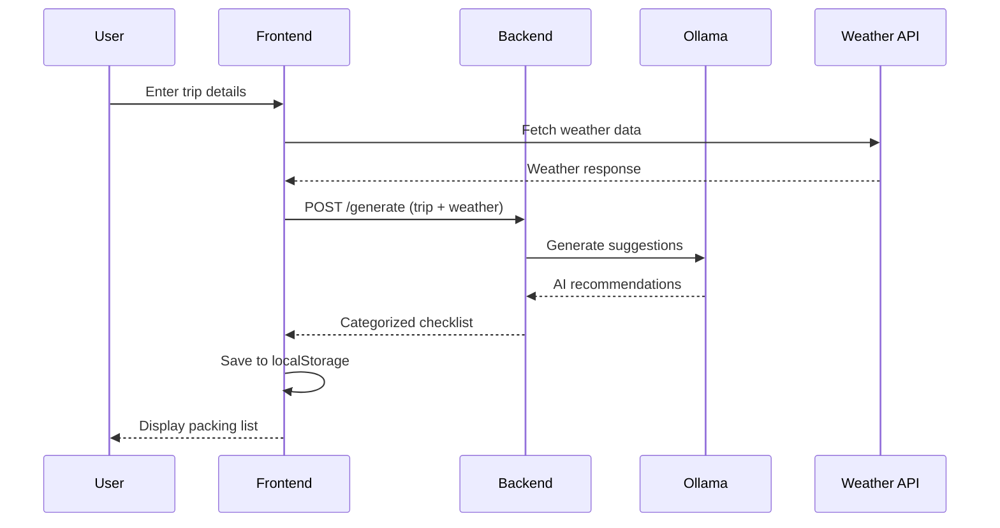

<!--
This file provides comprehensive system architecture documentation for SmartPack following the arc42 template industry standard.
Keep this comment at the top; do not overwrite or remove it when updating the document.

DOCUMENT PURPOSE:
- Central architecture reference following arc42 template (12 sections)
- Technical decision documentation with rationale and consequences
- System structure, components, and integration patterns
- Quality requirements with industry-standard metrics (WCAG 2.1, Web Vitals, OWASP)
- Risk assessment and technical debt tracking

WHEN TO UPDATE:
1. MAJOR CHANGES: Component additions/removals, new integrations, architectural decisions
2. QUALITY UPDATES: New requirements, testing strategies, performance targets
3. DEPLOYMENT CHANGES: Infrastructure updates, environment modifications
4. TECHNOLOGY DECISIONS: Stack changes, library additions, tool updates
5. CROSS-REFERENCES: Update links when other docs are restructured

UPDATE GUIDELINES:
- Follow arc42 section structure (1-12) - do not reorganize sections
- Update ADRs (Section 9) for significant technical decisions with Status/Decision/Rationale/Consequences
- Keep quality requirements (Section 1.2) aligned with actual implementation and industry standards
- Update building block view (Section 5) when component structure changes
- Maintain visual diagrams in sync with actual system structure
- Reference specific files, components, and external documentation

QUALITY STANDARDS:
- All requirements must be SMART (Specific, Measurable, Achievable, Relevant, Time-bound)
- Include industry references (WCAG 2.1 AA, Google Web Vitals, OWASP guidelines)
- Provide implementation details with specific tools and thresholds
- Link to detailed implementation in DEVLOG.md and TROUBLESHOOTING.md

CROSS-REFERENCE MAINTENANCE:
- Update "See Also" section when prompt files or documentation structure changes
- Validate external links and industry standard references quarterly
- Ensure consistency with CHECKLIST.md progress tracking and ROADMAP.md phases
- Keep glossary (Section 12) current with project terminology

HOW TO USE FOR AI ASSISTANCE:
- Reference this document for system understanding before making changes
- Use ADRs to understand why decisions were made before proposing alternatives
- Check quality requirements before implementing features to ensure compliance
- Consult building block view for component relationships and dependencies
-->

# Architecture Overview for SmartPack

This document follows the [arc42 template](https://arc42.org) for architecture documentation and provides a comprehensive view of the SmartPack travel packing application.

## 1. Introduction and Goals

### 1.1 Requirements Overview

SmartPack is a mobile-first, single-user travel packing application that provides AI-powered packing recommendations based on trip details and weather conditions.

**Key Features:**

- Intelligent packing list generation using local AI (Ollama)
- Weather-aware recommendations via Open-Meteo API
- Persistent storage using browser localStorage
- Responsive design for mobile and desktop use

### 1.2 Quality Goals

The following quality requirements are aligned with industry standards and define testable scenarios with clear success metrics:

| ID          | Quality Attribute                  | Proposed Requirement                                                                                                                                                          | Industry Reference                   |
| ----------- | ---------------------------------- | ----------------------------------------------------------------------------------------------------------------------------------------------------------------------------- | ------------------------------------ |
| **A11Y-1**  | Accessibility                      | Meet **WCAG 2.1 AA** for color-contrast, keyboard nav, alt-text, ARIA roles, focus order, error messages. Automated axe-core scan must report 0 critical issues in CI.        | W3C WCAG 2.1 standard                |
| **PERF-1**  | Performance                        | Largest Contentful Paint (LCP) ≤ **2.5s** at 75th-percentile on home-Wi-Fi (Cable/3G in WebPageTest).                                                                         | Google Web Vitals threshold          |
| **REL-1**   | Reliability / Graceful Degradation | If `/generate` fails (network or Ollama) → show cached list within 1s and banner "AI offline". Local data persists across refresh/tab close via `localStorage`.               | Industry standard for SPA resilience |
| **SEC-1**   | Privacy & Security                 | No third-party analytics. All trip data stored only in `localStorage`. Add Content-Security-Policy: `default-src 'self'`. Follow OWASP guidance for safe client-storage.      | OWASP HTML5 Security Cheat Sheet     |
| **MAINT-1** | Maintainability & Code Quality     | Codebase must:<br>• ≥ 80% line & branch coverage (Vitest)<br>• Pass ESLint + Prettier in CI<br>• Have clear comments per Copilot rules<br>• Merged PRs auto-deploy within 1h. | Industry best practices for CI/CD    |

### 1.3 Maintainability & Code Quality Implementation

| Area                | Recommended Practice                                                                         |
| ------------------- | -------------------------------------------------------------------------------------------- |
| **Coverage**        | Keep global ≥ 80%. Exclude generated/vendor code with `/* istanbul ignore file */` comments. |
| **Static Analysis** | ESLint strict + TypeScript `noImplicitAny`, Prettier auto-format; CI fails on lint errors.   |
| **Testing Pyramid** | Many unit tests (RTL), some integration (Supertest), handful of E2E (Playwright).            |
| **CI Time-to-Prod** | GitHub Actions → S3 & Lambda deploy ≤ 60 min after merge.                                    |
| **Code Review**     | PR template: check tests added, coverage unchanged, a11y queries used, no console.logs.      |

### 1.4 Stakeholders

| Role       | Expectations                              | Influence |
| ---------- | ----------------------------------------- | --------- |
| End Users  | Fast, accurate packing suggestions        | High      |
| Developers | Clean, testable, well-documented code     | High      |
| DevOps     | Simple deployment, minimal infrastructure | Medium    |

## 2. Architecture Constraints

### 2.1 Technical Constraints

- **Browser Compatibility:** Modern browsers with ES2020+ support
- **Data Storage:** localStorage only (no cloud sync)
- **AI Processing:** Local Ollama instance required for full functionality
- **API Dependencies:** Open-Meteo API for weather data

### 2.2 Organizational Constraints

- **Team Size:** Single developer project
- **Technology Stack:** React + TypeScript + Vite ecosystem
- **Deployment:** Static hosting with serverless backend

### 2.3 Conventions

- **Code Quality:** TypeScript strict mode, comprehensive testing
- **Documentation:** README-driven development, inline code documentation
- **Version Control:** Git with conventional commits

## 3. System Context and Scope

### 3.1 Business Context

```
[User] --uses--> [SmartPack App] --fetches--> [Open-Meteo API]
                      |
                 --queries--> [Local Ollama AI]
```

**External Entities:**

- **Users:** Travelers planning packing lists
- **Open-Meteo API:** Weather data provider
- **Ollama Service:** Local AI inference engine

### 3.2 Technical Context

- **Frontend:** Single-page application served statically
- **Backend:** Express.js Lambda for AI processing
- **Storage:** Browser localStorage (no external databases)
- **AI:** Local Ollama instance running llama3.1:8b model

## 4. Solution Strategy

### 4.1 Technology Decisions

| Decision               | Rationale                                 | Trade-offs                              |
| ---------------------- | ----------------------------------------- | --------------------------------------- |
| **Local AI (Ollama)**  | Privacy, no API costs, offline capability | Setup complexity, hardware requirements |
| **localStorage**       | Simple deployment, no backend needed      | Limited storage, no sync across devices |
| **React + TypeScript** | Developer productivity, type safety       | Bundle size, build complexity           |
| **Tailwind CSS**       | Rapid UI development, consistency         | CSS bundle size, learning curve         |

### 4.2 Quality Achievement

- **Privacy:** Local-only AI processing and data storage
- **Performance:** Client-side rendering, optimized bundles
- **Reliability:** Fallback data when AI unavailable
- **Maintainability:** TypeScript, testing pyramid, documentation

## 5. Building Block View

### 5.1 Level 1: System Overview

### 5.1 Level 1: System Overview

```
┌─────────────────────────────────────────────────────────┐
│                    SmartPack System                    │
├─────────────────────┬───────────────────────────────────┤
│   Frontend (SPA)    │      Backend (Lambda)            │
│                     │                                   │
│ • React UI          │ • Express.js API                  │
│ • Trip Planning     │ • AI Integration                  │
│ • Packing Lists     │ • Weather Processing              │
│ • Local Storage     │ • Ollama Client                   │
└─────────────────────┴───────────────────────────────────┘
```

### 5.2 Level 2: Frontend Components

**Core Components:**

- **TripForm:** Multi-step trip planning with validation
- **MainLayout:** Three-column responsive layout
- **PackingList:** Dynamic checklist with CRUD operations
- **SuggestionsPanel:** AI-powered recommendation interface
- **TripDetails:** Trip information display with editing

**Supporting Components:**

- **Context Providers:** State management for trip and checklist data
- **Hooks:** Custom hooks for localStorage, weather API, and AI services
- **Utils:** Validation, formatting, and helper functions

### 5.3 Level 2: Backend Services

**API Layer:**

- **Health Check Endpoint:** System status verification
- **Generate Endpoint:** AI-powered packing list creation
- **Suggestions Endpoint:** Custom AI recommendations

**AI Integration Layer:**

- **Ollama Client:** Local AI model communication
- **Prompt Engineering:** Context-aware prompt generation
- **Fallback Service:** Mock data when AI unavailable

## 6. Runtime View

### 6.1 Primary Use Case: Generate Packing List



### 6.2 Error Handling Scenarios

**AI Service Unavailable:**

1. User requests suggestions
2. Backend attempts Ollama connection
3. Connection fails (timeout/error)
4. Backend returns fallback mock data
5. Frontend displays suggestions with "fallback" indicator

**Weather API Failure:**

1. User enters destination
2. Weather API request fails
3. Frontend shows generic weather placeholder
4. AI still generates suggestions without weather context

## 7. Deployment View

### 7.1 Development Environment

```
┌─────────────────┐    ┌─────────────────┐    ┌─────────────────┐
│   Frontend      │    │    Backend      │    │  Ollama Service │
│                 │    │                 │    │                 │
│ localhost:5173  │◄──►│ localhost:3000  │◄──►│ localhost:11434 │
│ (Vite Dev)      │    │ (Express)       │    │ (AI Model)      │
└─────────────────┘    └─────────────────┘    └─────────────────┘
```

### 7.2 Production Environment (Planned)

```
┌─────────────────┐    ┌─────────────────┐    ┌─────────────────┐
│   Static Host   │    │  AWS Lambda     │    │  Cloud Instance │
│                 │    │                 │    │                 │
│ S3 + CloudFront │◄──►│ Express Handler │◄──►│ Ollama Service  │
│ (React SPA)     │    │ (API Gateway)   │    │ (Docker)        │
└─────────────────┘    └─────────────────┘    └─────────────────┘
```

### 7.3 Infrastructure Requirements

**Development:**

- Node.js 18+ (Frontend build tools)
- Ollama service running locally
- Modern browser (ES2020+ support)

**Production:**

- Static hosting (S3, Netlify, Vercel)
- Serverless runtime (AWS Lambda)
- Docker container for Ollama (cloud instance)

## 8. Cross-cutting Concepts

### 8.1 Domain Model

**Core Entities:**

- **Trip:** Dates, destinations, travel modes, details
- **ChecklistItem:** Text, category, completion status, AI-generated flag
- **Category:** Name, items collection, UI organization
- **Weather:** Location, temperature, conditions, precipitation

### 8.2 User Experience Patterns

- **Progressive Enhancement:** Core functionality works without AI
- **Mobile-First Design:** Touch-friendly interfaces, responsive layouts
- **Accessibility:** WCAG 2.1 AA compliance, semantic HTML, ARIA labels
- **Performance:** Lazy loading, code splitting, optimized bundles

### 8.3 Security Concepts

- **Data Privacy:** All data remains on user's device
- **Input Validation:** Client and server-side validation
- **API Security:** Rate limiting, request sanitization
- **Error Handling:** No sensitive information in error messages

### 8.4 Testing Strategy

```
E2E Tests (Playwright)     ←→ User Workflows
Integration Tests (RTL)    ←→ Component Interactions
Unit Tests (Vitest)        ←→ Business Logic
```

## 9. Architecture Decisions

### 9.1 ADR-001: Local AI Processing

**Status:** Accepted  
**Decision:** Use local Ollama instance instead of cloud AI APIs  
**Rationale:** Privacy, cost control, offline capability  
**Consequences:** Setup complexity, hardware requirements

### 9.2 ADR-002: localStorage for Persistence

**Status:** Accepted  
**Decision:** Use browser localStorage instead of backend database  
**Rationale:** Simplified deployment, privacy, no backend costs  
**Consequences:** No cross-device sync, storage limitations

### 9.3 ADR-003: React + TypeScript Stack

**Status:** Accepted  
**Decision:** React with TypeScript for frontend development  
**Rationale:** Developer productivity, type safety, ecosystem  
**Consequences:** Bundle size, build complexity

## 10. Quality Requirements

### 10.1 Quality Implementation Details

The core quality requirements are defined in Section 1.2 above. This section provides implementation guidance and additional context:

### 10.2 Accessibility Implementation (A11Y-1)

- **WCAG 2.1 AA Compliance:** All contrast ratios ≥ 4.5:1, keyboard navigation support
- **Screen Reader Support:** Semantic HTML, ARIA labels, proper heading hierarchy
- **Automated Testing:** axe-core integration in CI pipeline with 0 critical issues tolerance
- **Testing Tools:** @axe-core/react, jest-axe, Playwright accessibility assertions

### 10.3 Performance Implementation (PERF-1)

- **Web Vitals Monitoring:** LCP ≤ 2.5s measured via WebPageTest at 75th percentile
- **Bundle Optimization:** Code splitting, tree shaking, dynamic imports for routes
- **Resource Optimization:** Image compression, font optimization, preload critical resources
- **Measurement Tools:** Lighthouse CI, WebPageTest API, Core Web Vitals Chrome extension

### 10.4 Reliability Implementation (REL-1)

- **Graceful Degradation:** Cached data display with clear offline indicators
- **Data Persistence:** localStorage with error handling and corruption recovery
- **Network Resilience:** Retry logic, timeout handling, connection status detection
- **Testing Strategy:** Playwright network simulation, localStorage persistence tests

### 10.5 Security Implementation (SEC-1)

- **Privacy by Design:** No third-party analytics, no data transmission to external services
- **Content Security Policy:** Strict CSP headers preventing XSS and data exfiltration
- **Client-side Security:** Input sanitization, safe localStorage usage patterns
- **Compliance Tools:** OWASP ZAP scans, Lighthouse privacy audits, CSP validation

### 10.6 Maintainability Implementation (MAINT-1)

- **Code Coverage:** ≥80% line and branch coverage with Istanbul exclusion comments
- **Static Analysis:** ESLint strict + TypeScript noImplicitAny, Prettier auto-format
- **CI/CD Pipeline:** GitHub Actions with automated testing, linting, and deployment
- **Code Review Process:** PR templates ensuring quality gates are met before merge

## 11. Risks and Technical Debt

### 11.1 Technical Risks

| Risk                     | Probability | Impact | Mitigation                        |
| ------------------------ | ----------- | ------ | --------------------------------- |
| Ollama setup complexity  | High        | Medium | Comprehensive setup documentation |
| localStorage size limits | Medium      | Low    | Data cleanup strategies           |
| Browser compatibility    | Low         | Medium | Progressive enhancement           |

### 11.2 Technical Debt

- **Missing Production Deployment:** No production infrastructure defined
- **Limited Error Monitoring:** No centralized error tracking
- **Manual Testing:** E2E tests require manual Ollama setup

## 12. Glossary

| Term             | Definition                                   |
| ---------------- | -------------------------------------------- |
| **Ollama**       | Local AI inference platform for running LLMs |
| **llama3.1:8b**  | 8-billion parameter language model           |
| **Open-Meteo**   | Free weather API service                     |
| **localStorage** | Browser API for client-side data storage     |
| **SPA**          | Single Page Application                      |
| **PWA**          | Progressive Web Application                  |
| **RTL**          | React Testing Library                        |

## See Also

- [ROADMAP.md](../.github/prompts/ROADMAP.md)
- [copilotdocs/COMMANDS.md](../copilotdocs/COMMANDS.md)
